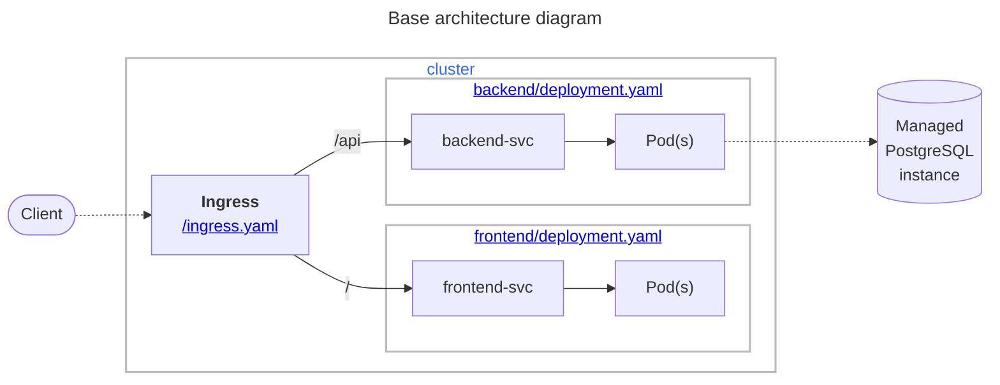

# Architecture
## Kubernetes Architecture

```mermaid
---
title: Base architecture diagram
---
graph LR
 client([Client])-.->ingress["<b>Ingress</b>
  <a href='https://github.com/Ilmastokompassi/Ilmastokompassi/blob/main/kubernetes/base/backend/deployment.yaml'>/ingress.yaml</a>"];
 ingress-->|"/"|svc1[frontend-svc];
 ingress-->|"/api"|svc2[backend-svc]

 subgraph cluster
  ingress;
  subgraph fe-deploy["
    <a href='https://github.com/Ilmastokompassi/Ilmastokompassi/blob/main/kubernetes/base/frontend/deployment.yaml'>frontend/deployment.yaml</a>"]
   svc1-->pod1["Pod(s)"];
  end
  subgraph be-deploy["
    <a href='https://github.com/Ilmastokompassi/Ilmastokompassi/blob/main/kubernetes/base/backend/deployment.yaml'>backend/deployment.yaml</a>"]
   svc2-->pod2["Pod(s)"];
  end
 end

pod2-..->db[("Managed<br>PostgreSQL<br>instance")]


 click ingress "../kubernetes/base/ingress.yaml" _parent;
 click be-deploy "../kubernetes/base/backend.yaml" _parent;
 click fe-deploy "../kubernetes/base/frontend.yaml" _parent;

 classDef cluster fill:#fff,stroke:#bbb,stroke-width:2px,color:#326ce5;
 
 class ingress,svc1,svc2,pod1,pod2 k8s;
 class client plain;
 class cluster cluster;
```
 